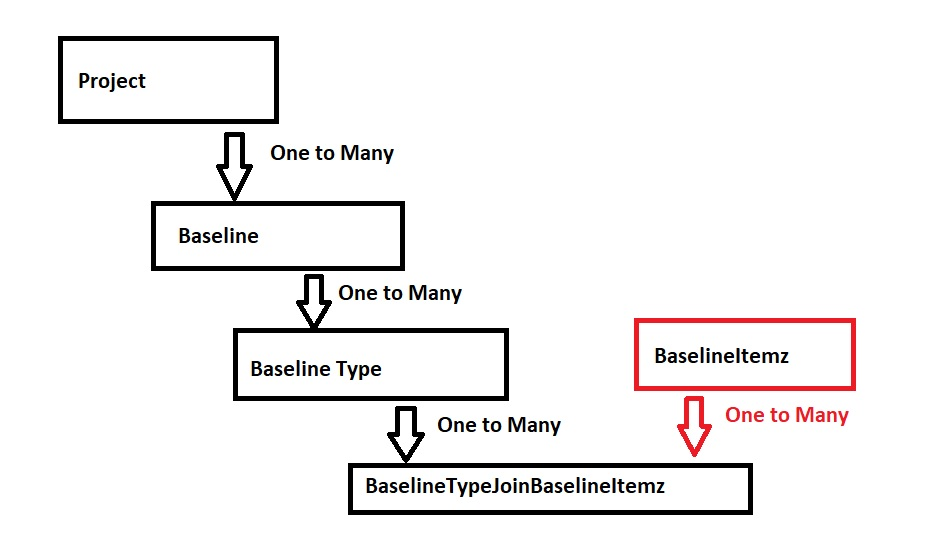


# Design Decision of Baselining

Broadly speaking there are two options for creating Baseline. First, write Baseline Creation Logic in the Web API Application itself. Second, write a store procedure in SQL Server that has Baseline Creating Logic implemented directly in the Database.

Let’s have a look at cons and pros for both these options.

In the First option where we keep baseline creation logic within Web API Application.

### Pros:

-	Abstraction. Here the advantage would be that without depending on the Database Code, one could implement branch creation process at the Web API App level. This means tomorrow if we need to replace SQL Server with some other datastore then actual code of creating baseline shall work nicely with minimal effort to make it compatible and work with different datastore. 
-	Support for Custom Attributes. In the future, we have plans to implement custom attributes on requirements records. Users shall be allowed to introduce their own custom fields / attributes on requirements type / project / repository level. In such a case, where user defined attributes are present in requirements then the baseline that we capture shall include details about such custom fields. This will be easier to handle in Web API Application rather then directly in the database.
-	Small and incremental changes to the actual logic of Baseline creation shall be easily performed via incremental releases of Web API Apps. Not every change would touch database schema / stored procedure code. This shall enable smooth upgrade process for customers and for the development team as well.
-	It becomes possible to write Unit Tests for complex logics that are introduced in Web API App for managing Baseline features. 

### Cons:

-	Performance. Every time baseline creation process has to bring in all the data from the database all the way to Web API App and then process it and send back insert / update commands back to the database. This could slow down the entire process.
-	Complexity. Code in C# could be lot more complex compared to a Stored Procedure code that we store in SQL Server directly.
-	Concurrency. As we need to process every record in a given Project / Requirement Type from Web API App, it could lead to concurrency issues as there are high probability that underlying data in the project might be changed by someone else during baseline management process.
-	In future, it might become harder to support clustering features for Web API App as baselining could be a long running task that will touch several records. This could be much better if we allow management of baselines directly in Database via Stored Procedures.
-	Overall Baseline Operation Transaction Management could become difficult as multiple commands will be executed against the database. 

Mainly the Pros from the first option above could potentially become Cons for the second option and vice versa.

### Conclusion
Given that we are in the initial phase of application development for ItemzAPI, our current decision is to write baseline logic directly in the Stored Procedure and get the feature rolled in. This will require us to work with empty migration in EF Core in which we hand type Stored Procedure code for Up and Down methods. 

In the future we might decide to move such Stored Procedure logic over to Web API App or introduce some sort of hybrid option where some part of the logic is ported over to Web API App and multiple Stored Procedures are created to support the overall process of Baseline Management.

---

# Removing BaselineItemz post deleting Project / Baseline / BaselineType

While working on implementing Baselines in ItemzAPI, we learned one more thing for which it's important to capture design decision details as per below.

Key difference between Itemz and BaselineItemz is that when Project is deleted then all it's associated Itemz are marked as Orphend Itemz. But in the same case, when we delete a Project then all associated BaselineItemz shall be removed instead of staying in the system as Orphend BaselineItemz. So this means we have to either 
 - set-up trigger in the database to remove BaselineItemz
 - Or Make sure that we call Delete Orphend BaselineItemz from ItemzAPI
 - Or we periodically remove them from the system

Following diagram shows relationship between different baselines tables within ItemzApp

As you can see in the above diagram, Database is designed to automatically delete Baseline, BaselineTypes, BaselineTypesJoinBaselineItemz when Project is deleted. This is because we perform Cascade Delete in Child Table when Parent table data is deleted.

We don't do this in the other direction. i.e. When record in BaselineTypesJoinBaselineItemz table is deleted then we don't delete this record from it's Parent table BaselineItemz. 

This way, we are left with Orphend BaselineItemz. 

For now, we think the best way to take care of this would be to delete records from BaselineItemz that does not have related referenced data in BaselineTypesJoinBaselineItemz via Stored Procedure that can then be called from within ItemzAPI. This means that in the following events, we have to call this Stored Procedure to perform necessary clean-up.

 - When Project is Deleted
 - When Baseline is Deleted
 - When BaselineType is Deleted

### Conclusion
Instead of adding trigger in the SQL Server Database for table BaselineTypesJoinBaselineItemz to remove unreferenced data from it's parent table BaselineItemz, we will create a separate Stored Procedure to perform this clean-up. This way, we are not depending too much into capabilities provided by SQL Server for now.

---
# Reversing relation between BaselineTypeJoinBaselineItemz and BaselineItemz

Right now it's not cascade deleting BaselineItemz because it's parent to BaselineTypeJoinBaselineItemz table. It has to be child of BaselineTypeJoinBaselineItemz table. 

What is the consequence of changing referential integrity other way round?

i.e. we first insert BaselineTypeJoinBaselineItemz and then capture newly created GUID as OUTPUT - INSERTED value that we use for inserting record in BaselineItemz. This way, we can mark BaselineTypeJoinBaselineItemz as parent and BaselineItemz as child. 

Later if we delete Project / Baseline / BaselineType then we automatically remove records via CASCADE delete from both the tables, BaselineTypeJoinBaselineItemz and BaselineItemz respectively. 

We are not sure what will be the impact of this when it comes to querying data via EF Core. As well as what will be the impact when we support custom Data Types in the future. I do not think it will be a huge problem as referenced records are well supported in EF Core. Ultimately it will have One to many referential integrity between Project --> Baseline --> BaselineType --> BaselineTypeJoinBaselineItemz. And ultimately it will have One to Zero OR One referential integrity between  BaselineTypeJoinBaselineItemz --> BaselineItemz.

We will have to try this option out in a separate branch that we create from BaselineBranch. 

### Conclusion

Due to time constrains as well as further complexity expected in future version of ItemzApp with respect to introduction of Custom Attributes on Itemz, we are dropping this idea of reversing Parent and Child relationship between tables  BaselineTypeJoinBaselineItemz and BaselineItemz. 

Lets leave BaselineItemz as Parent and BaselineTypeJoinBaselineItemz as child with One to Many relationship. 

What we might encounter is that some repositories may have large number of Orphend BaselineItemz when Project / Baseline / BaselineItemzType is deleted. That said, we should cover it as part of custom user defined stored procedure that shall be called as part of Project / Baseline / BaselineItemzType deletion action.

# Including or Excluding collection of BaselineItemzs should belong to a single Baseline

Users shall mainly perform maintenance of BaselineItemzs from ItemzAPP Web UI. This means via the UI, it will send request to update collection of BaselineItemzs to be either included / excluded against a single Baseline. In this scenario, we don't have to worry much about making sure that BaselineItemzs belongs to a single baseline itself. In this case, we expect that ItemzApp will have necessary logic baked into it for first querying for BaselineItemz(s) against a given Baseline and then allow users to include / exclude those BaselineItemz(s). 

On the other hand, we will have users who write custom scripts, custom applications, custom integrations, etc. that will consume ItemzAPI directly. In this case, we don't want them to update information about inclusion or exclusion for collection of BaselineItemz(s) that belongs to multiple different Baselines. We shall implement necessary check to make sure that BaselineItemz(s) belongs to a single Baseline itself. This way, we don't accidently update BaselineItemz(s) details from unintended baselines that belongs to either different project altogether or for some other user. 

In the future, most of the things shall fall in place when system will have access rights and authorization management capabilities in place. This way, we would block users from updating details about BaselineItemz(s) from other Baselines as they might not have permission to do so. That said, this check is good one to make sure that users shall not update BaselineItemz(s) data in unexpected Baselines even by accident. 

ItemzAPI shall make sure that entire request for updating BaselineItemz(s) is cancelled / ignored event when a single BaselineItemz does not belong to intended Baseline. It would be ideal to check for all and send back detail about which all BaselineItemz(s) does not belong to the target Baseline but this is something we can look into in the future. For now, an error along with ID of the failed BaselineItemz shall be returned. 

### Conclusion

We expect BaselineItemzs to be included / excluded as per user needs. This shall allow users to perform some adjustments to the Baseline before finalizing the same. In many cases, users shall update the project data and then take yet another baseline and remove the first one which is obsolete. That said, sometimes it’s necessary to just remove few selective BaselineItemzs from the Baseline and generate output from the same on the fly. 
So support for Including and Excluding BaselineItemz(s) shall allow users to make necessary adjustments in a single baseline for now.

# Difference between Orphaned BaselineItemz V/s Excluded BaselineItemz

Exclusion of BaselineItemz from a Baseline is like a soft delete. This can be recovered back by setting inclusion flag back to true on BaselineItemz(s) itself.

That said, when Project / Baseline / BaselineItemzType is deleted then we expect all the BaselineItemzs to be deleted as well. This is more or less a Hard Delete of BaselineItemzs. We leave it in Orphaned stage until we call User Stored Procedure “userProcDeleteAllOrphanedBaselineItemz”

Basically, we don’t immediately call “userProcDeleteAllOrphanedBaselineItemz” while we remove Project / Baseline. There could be delay of few miliseconds between calling Delete Project and then calling user stored procedure “userProcDeleteAllOrphanedBaselineItemz”. Because this two are separate calls, we might encounter that sometimes due to network failure, or human error, or bug, etc. could cause failure of removing Orphaned Baseline Itemzs. In such situation, we will experience that subsequent calls to remove other Project / Baseline / BaselineType shall remove all the accumulated Orphaned Baseline Itemzs in one shot. 

Exclusion and Inclusion of BaselineItemz(s) are performed on active Project + Baseline. This allows users to control scope of an active baseline instead. This is different then Orphaned BaselineItemzs as they are suppose to be removed from the system at the time when Project / Baseline / BaselineItemzType is removed.

### Conclusion

Excluded BaselineItemzs are like soft deleted (soft removed) BaselineItemzs from it’s parent BaselineItemzTypes where as Orphaned BaselineItemzs are those which are supposed to be removed (like hard delete) as their parent BaselineType / Baseline / Project has been removed.

You can Include BaselineItemzs that are in exclusion state where as you can’t bring back Orphaned Baseline Itemzs as their parent has been hard deleted already. 

# Copy value for IsIncluded when creating new Baseline based on existing Baseline

In most cases, users may would like to create new baseline based on existing baseline for making further changes. This is the reason to copy value for IsIncluded as part of Create Baseline based on existing Baseline feature. 

We shall also look into supporting feature to re-set existing baseline to include all in one shot. 

### Conclusion

Instead of including all by default we copy value of IsIncluded when creating new Baseline based on existing one. 

