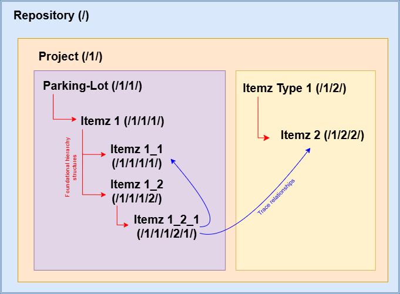

# Concept of Hierarchy

### Why do we need hierarchical structures?

Having a well-constructed parent-child project structure can prove to be immensely beneficial. It allows users to easily:

1.	Define each data item in its own right
2.	Organise the data effectively
3.	Put each data item into perspective in relation to other Itemz i.e the wider concept
4.	Dictate the order and scope of task execution when the user interacts with the project.

Taking into account these excellent benefits of organising project data into a hierarchical structure, the ItemzApp will aim to provide users with the utmost flexibility and autonomy possible so that they can easily and neatly organise their data into a hierarchical tree. 

#### In what ways can I create relations between Itemz within my project?

You can:
1.	Create the foundational hierarchy structure: this consists of the basic Itemz breakdown tree that relates Itemz in a direct parent-child manner
(Refer to the red relationship lines in figure below)
2.	Additional relationships between Itemz i.e Trace relationships: creates a trace between 2 Itemz so that they are related. However, in contrast to the foundational hierarchical structure, these Itemz are not related by a parent-child relationship. You might liken them to bring cousin Itemz wherein the Itemz have a relationship/dependency between them, however they are not directly related. 
(Refer to the blue relationship lines in figure below)

To ensure users can freely define relationships between their Itemz, the ItemzApp will provide users the autonomy to create both foundational (parent-child) links and trace (cousin) links in between their Itemz. 
The ItemzApp considers both the foundational hierarchy structure and the trace relationships as independent ways to define structure. Hence, when the user establishes a foundational parent-child link in between 2 Itemz, no default trace links will be generated by the ItemzApp. If the user would like to create a trace link between their Itemz, they have control over creating these links. Similarly, creating a trace link between 2 Itemz will not create any default foundational parent-child links between the Itemz; the user has complete control over the design of the foundational hierarchy structure. This further empowers the user to freely design the hierarchy of their project to best suit their needs.

Therefore, users can:

1.	Rely on the Foundational Parent and Child hierarchical breakdown structure to define their relationships between their Itemz.
2.	Keep Itemz structure almost flat in terms of the foundational hierarchical breakdown structure but use Trace relations to define their relationships between their Itemz.
3.	Use hybrid model where some Itemz relationships are defined via the foundational hierarchical breakdown structure and also use Traces to define other Itemz relationships.

Fortunately, the ItemzApp does not enforce one way over another when it comes to defining relationships between Itemz! Users freely define all relations by themselves based on different functionalities supported by the application and can document their own ways of defining Itemz relationships to best suit their needs.

#### Overall Hierarchy Structure

As far as Parent and Child Structure is concerned, logically speaking, ItemzApp has following hierarchy structure.

ItemzApp Repository >>> Project(s) >>> ItemzType(s) >>> Itemz(s) >>> multiple level of SubItemz(s). 

Within ItemzApp, users are allowed to define their own ItemzType(s). That said, ItemzApp also support concept of “Parking Lot” ItemzType. Every project by default has system ItemzType which is called “Parking Lot”. This is where users park their Itemz which are either not fully defined or they are not in scope of a given project but can be considered in the future.

ItemzApp shall allow defining Parent and Child Itemz Hierarchy support between Itemz that are stored in “Parking Lot” and this way, we can move a given set of Parent and Child Itemz together between different types including “Parking Lot” inbuild system ItemzType.  

#### Will hierarchy be maintained in Recycle Bin as well?

No, Recycle Bin contains Itemz which are marked for deletion. They are intended to be fully removed from the system. So, it’s not going to store details about Itemz Parent and Child Hierarchy relationship in it. If user would like to restore Itemz from Recycle Bin then they will have to re-create Parent and Child relationship for the restored Itemz. 

This way, it’s not necessary that Itemz within a parent and child hierarchical set will have to be restored together. Users will be able to restore some Itemz as necessary from the Recycle Bin without having to restore entire sets. In future we may also support restoring hierarchical sets of requirements from Recycle Bin but for now it’s something we will not be supporting.

Projects and users who wants to de-scope a given Itemz parent and child hierarchical data set from the project shall utilize “Parking Lot” system ItemzType. Instead of deleting Itemz hierarchical sets, one can consider moving them into “Parking Lot” so that they can bring it back to a project in the future. 

#### Where shall we compute and identify Hirarchy ID value for Itemz?

We have two choices here. We can pass in only the Parent OR Child Itemz information to the client side software and let the client side software compute Hierarchy ID depending upon how Itemz are displayed to the users. In this design we do  not store actual HierarchyID number in the datastore but instead we only have to capture information about ParentID in every Child Itemz record. Because, in this architecture we expect client software to compute and produce the Hierarchy ID number  for Itemz based on their position in the context in which it appears. This will require Client software to be more intelligent and will not be very easy to test it and enhance it in the future. This will make client software to hold some processing logic which can be avoided if we decide to compute and store hierarchy ID in the application tier. 

This is the reason why we shall now compute this at server side and store Itemz Hierarchy ID details along with Itemz in the datastore. Because we will support obtaining information about Hierarchy ID through Rest API, it will be easy to use the same in different types of client application for processing this information appropriately. 

#### Are there any reserved numbers within Hierarchy ID?

As far as implementation is concerned, we expect following reserved numbers formatting to Indicate information about container objects. 

**Example**

/1/1/1/

-	Starting '/' (forward slash) Indicates Repository Node. *This will remain as it is for all Itemz. i.e. it will always start as '/' (forward slash)
-	First number as '/**1**/' indicates Project number 
-	Second number as '/1/**1**/' indicates ItemzType number within project. Most likely this will be “Parking Lot” Itemz type as that would be 1st ItemzType within each project.
-	Third number as '/1/1/**1**/' Indicates first Itemz

**Next example**

/1/4/2/8/

-	Number 1 represents 1st Project
-	Number 4 indicates 4th ItemzType
-	Number 2 indicates 2nd Itemz
-	Number 8 indicates 8th Sub-Itemz.

**Next example**

/4/3/7/2/1/9/

-	Number 4 represents 3rd Project
-	Number 3 indicates 3rd ItemzType
-	Number 7 indicates 7th Itemz
-	Number 2 indicates 2nd child of 7th Itemz
-	Number 1 indicates 1st child of 2nd child of 7th Itemz
-	Number 9 indicates 9th child of 1st child of 2nd child of 7th Itemz

**Next example**

/1/7/3/2/1.1/

-	Number 1 represents 1st Project
-	Number 7 indicates 7th ItemzType
-	Number 3 indicates 3rd Itemz
-	Number 2 indicates 2nd child of 3rd Itemz
-   Number 1.1 indicates that it's in between '/1/7/3/2/1' and '/1/7/3/2/2/' as 1.1 child of 2nd child of 3rd Itemz. 

**Next example**

/1/3/
-	Number 1 represents 1st Project
-	Number 3 indicates 3rd ItemzType
-	This number stops at ItemzType and it does not represent any Itemz instead it represents ItemzType.

**Next example**

/1.1/3/5/
-	Number 1.1 is wrong as we don’t expect projects to ever move within the repository. Projects are always incrementing by 1 as there is no need to change project hierarchy within ItemzApp. 

// TODO START REVIEW FROM HERE
**Next example**

/1/1.1/5/
-	Number 1 represents 1st Project
-	Number 1.1 indicates ItemzType which is logically in between ItemzType 1 and ItemzType 1.2 or greater.
-	Number 5 indicates 5th Itemz.

#### Why do we want to capture Repository as part of Hierarchy ID and why should it always be '/' (forward slash)?

While doing research about Hierarchy ID support for SQL Server database, we came across several articles that explains that root should always  be one object. Everything else should hang off the root object. Because highest most container of data within ItemzApp is Repository, we thought it will be easier to start with repository to be the root of the Itemz Hierarchy. 

Also, default value is '/' (forward slash) for the root / first object in Hierarchy context and so we decided to keep it at that as the start of the hierarchy ID which will represent Repository itself. 

After Repository, we believe next logic container should be Project. We expect customers to move Itemz including it’s child Itemz hierarchy sets from one place to another place. That could also include moving it across projects and so having project being part of Hierarchy ID would help a lot. 

#### When should Hierarchy ID number be in decimal points?

In ItemzApp, we allow ItemzType and Itemz to move it's location within Hierarchy Tree. Due to this there are possibilities for them to be assigned Hierarchy ID as Decimal Number. Lets take few examples in which decimal numbers will be assigned.

**Example 1 :**

If we already have Itemz with ID '/1/2/1/' and '/1/2/2/' and we move / create new Itemz in between these two itemz then the Hierarchy Id provided to it would be '1/2/1.1/'.

**Example 2 :**

If we already have Itemz with ID '/1/2/1/' and '/1/2/1.2/' and we move / create new Itemz in between these two itemz then the Hierarchy Id provided to it would be '1/2/1.1/'.

**Example 3 :**

If we already have Itemz with ID '/1/2/1.1/' and '/1/2/1.2/' and we move / create new Itemz in between these two itemz then the Hierarchy Id provided to it would be '1/2/1.1.1/'.
 
#### Why should Project number be whole number in HierarchyID?

In ItemzApp, we don’t expect project to move from one place to another place within Hierarchy. Also, we create new projects by adding it to the repository using serialized numbers as far as Hierarchy is concerned. This is why a Project should always be a whole number like 1, 2, 3, etc. 

We expect customer to move “ItemzType” and “Itemz” around and so they can contain decimal numbers in the Hierarchy ID instead of just whole numbers. 

#### What’s impact of sharing Itemz in multiple places on Hierarchy ID?

As per current architecture, we expect one ItemzID to have one HierarchyID associated withit. This will, unfortunately, not allow Itemz to be shared across multiple places. So for now, we expect users to create copy of a given Itemz and share it at another location rather then performing a deep sharing of Itemz at multiple places. 

In the future, we may consider chaning this architecture to support deep sharing of Itemz at different places within repository.

#### Will we transform Hierarchy Number before sending it to the client application?

At this stage, we are planning to send the exact Hierarchy ID number as we store it in the datastore. In the future we might introduce additional transformation layer(s) that will change Hierarchy ID number while sending and receiving data over ItemzAPI.

#### How should Hierarchy ID be supported for Baseline and Itemz in it?

ItemzApp shall support storing Hierarchy ID for Baseline as per following structure

Repository >>> Project >>> Baseline >>> BaselineItemzType >>> Baseline Itemz >>>> Baseline SubItemz structure. 

**So the actual format will be**

/1/2/3/4/5/6/

-	Number 1 represents 1st Project
-	Number 2 indicates 2nd Baseline
-	Number 3 indicates 3rd BaselineItemzType
-	Number 4 indicates 4th BaselineItemz
-	Number 5 indicates 5th child of 4th BaselineItemz
-	Number 6 indicates 6th child of 5th child of 4th BaselineItemz

Users may decide to include / exclude BaselineItemz and this should impact BaselineItemz Parent and Child Hierarchy record sets. ItemzApp shall support multiple BaselineItemz related to each other via hierarchy record sets to be Included or Excluded together in one transaction. Any other impact this operation would have, say, on Traceability BaselineItemz shall also be considered and implemented for bulk operations of inclusion and exclusion of related hierarchy recordsets together.

#### Can BaselineItemz Hierarchy ID contain decimal point numbers?

Yes, It's possible for BaselineItemz to have HierarchyID containing decimal numbers. ItemzApp do not support moving BaselineItemz from one place to another place and so it does not generate Decimaml Numbers for Hierarchy ID due to such operation. That said, Baselines are snapshot of Itemz data at the time of taking the baseline. It performes several clones of original data including Hierarchy ID. So if the Itemz that are in scope of the baseline already contains Hierarchy ID with decimal points then it will be carried forward into Baseline Itemz Hierarchy ID as well. 

#### Will Hirarchy ID Number changing be captured as part of Change Management records?

No, because there are many reasons for HierarchyID number to change due to different actions users perform, it makes it not so interesting for users to have multiple change records of each and every such change be captured as part of Hierarchy ID changes. Also from actual usage perspective, we don't see any major relavance of capturing this values. 

Because we are going to support concept of Baselining, we expect users to take such snapshot when they achieve certain milestone in their requirements definition process. This will enable them to see location of Itemz with respect to the snapshot in time taken previously by the project using ItemzApp. 

