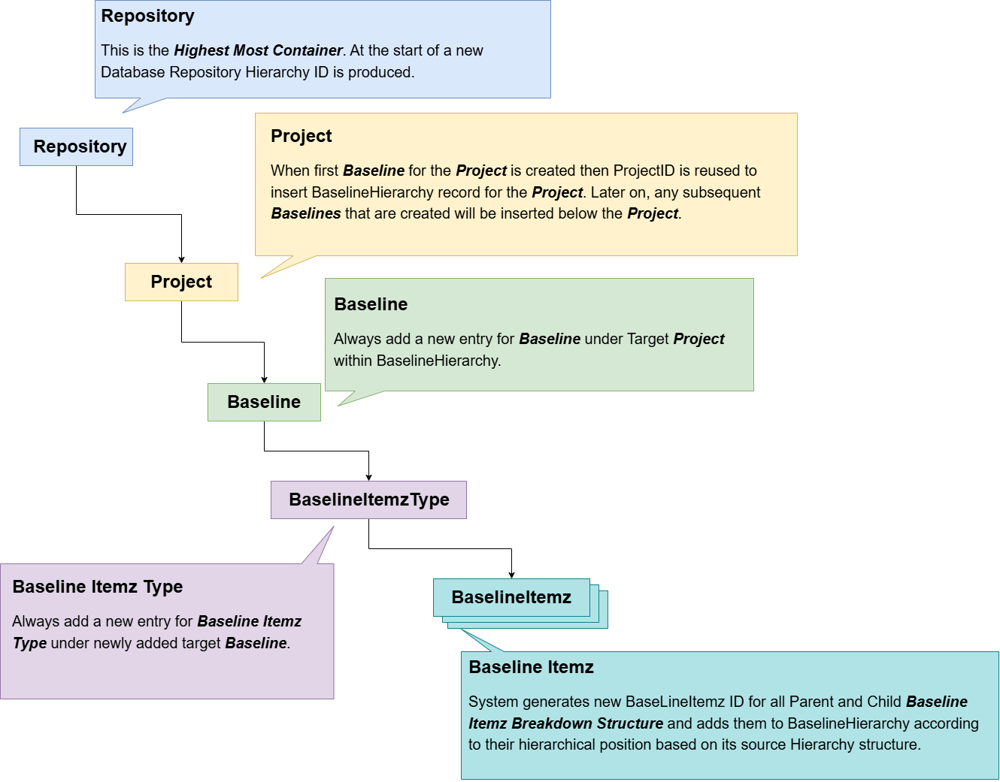



# Design Decision - Baseline Hierarchy Structure

ItemzApp supports taking Baseline during which it takes snapshot of hierarchy breakdown structure of Itemz. Following diagram shows information about different level of data being captured during the process of Baseline creation. 

For BaselineHierarchy data 

- every repostiory of ItemzApp will contain only one Repository node in the hierarchy data structure
- a Repository can contain many Projects in it
- a Project can contain many Baselines in it
- a Baseline can contain many BaselineItemzType in it
- a BaselineItemzType can contain many BaselineItemz in it
- a BaselineItemz can contain further many BaselineItemz in it to form Breakdown Structure.

# Design Decision - Baselining is scopped to a single project

ItemzApp allows users to take snapshots as Baselines of their data within a single project. Baseline Hierarchy details are stored in a separate table in the database as compared to Itemz Hierarchy details. They are managed as separate instances of data. As a result, users can independently manage their Itemz and Baseline Itemz. 

The scope of the baseline could range from either an entire Project or simply an ItemzType within a project. Currently Baselines are not allowed to be cross multiple project. 

Also, baselines will only copy those trace relationships which are in scope of the Itemz that are included in the baseline. For example, if you are taking baseline of a single project which contains Itemz that has traces to Itemz which are hosted in another project then Baseline shall not contain those specific external trace data

In the following example, “Project1> Itemz1” contains trace relations to “Project 2>Itemz1”. Since this trace relation is not contained within the same project, it will not be carried into the baseline. 

| Hierarchy Node Name | HierarchyId as String | Traces Relationship |
| ------------------- | --------------------- | ------------------- |
| Repository          | /                     |                     |
| Project1            | /1/                   |                     |
| Parking Lot         | /1/1/                 |                     |
| ItemzType1          | /1/2/                 |                     |
| Itemz1              | /1/2/1/               | /1/2/2/, /2/2/1     |
| Itemz2              | /1/2/2/               | /1/2/1/             |
| Project2            | /2/                   |                     |
| Parking Lot         | /2/1/                 |                     |
| ItemzType1          | /2/2/                 |                     |
| Itemz1              | /2/2/1/               | /1/2/1/             |

Baseline Snapshot for Project1 will look like as follows: …

| Hierarchy Node Name | HierarchyId as String | Traces Relationship |
| ------------------- | --------------------- | ------------------- |
| Repository          | /                     |                     |
| Project1            | /1/                   |                     |
| Baseline1           | /1/1/                 |                     |
| Parking Lot         | /1/1/1/               |                     |
| ItemzType1          | /1/1/1/2/             |                     |
| Itemz1              | /1/1/1/2/1/           | /1/1/1/2/2/         |
| Itemz2              | /1/1/1/2/2/           | /1/1/1/2/1/         |

In the following example, “ItemzType1> Itemz1” is having a trace relationship to “ItemzType2>Itemz3”. Now if the Baseline Snapshot is taken with scope of ItemzType1, then it will not include trace data between Itemz1 and Itemz3 because Itemz3 is out of the scope of the baseline. 

| Hierarchy Node Name | Hierarchy Id as String | Traces Relationship |
| ------------------- | ---------------------- | ------------------- |
| Repository          | /                      |                     |
| Project1            | /1/                    |                     |
| Parking Lot         | /1/1/                  |                     |
| ItemzType1          | /1/2/                  |                     |
| Itemz1              | /1/2/1/                | /1/2/2/, /1/3/1     |
| Itemz2              | /1/2/2/                | /1/2/1/             |
| ItemzType2          | /1/3/                  |                     |
| Itemz3              | /1/3/1/                | /1/2/1/             |
| Itemz4              | /1/3/2/                |                     |

Baseline Snapshot for ItemzType1 will look like as follows: 

| Hierarchy Node Name | HierarchyId as String | Traces Relationship |
| ------------------- | --------------------- | ------------------- |
| Repository          | /                     |                     |
| Project1            | /1/                   |                     |
| Baseline1           | /1/1/                 |                     |
| Parking Lot         | /1/1/1/               |                     |
| ItemzType1          | /1/1/1/2/             |                     |
| Itemz1              | /1/1/1/2/1/           | /1/1/1/2/2/         |
| Itemz2              | /1/1/1/2/2/           | /1/1/1/2/1/         |

# Design Decision – Multiple Baselines

ItemzApp supports taking multiple baseline snapshots of given data. In such cases, because ItemzApp maintains separate table in the database for Baseline Hierarchy data, we get different HierarchyIDs allocated to the baseline Itemz based on their order of creation.  

In the following example, we see data pertaining to a single project along with its accompanying trace information.

| Hierarchy Node Name | Hierarchy Id as String | Traces Relationship |
| ------------------- | ---------------------- | ------------------- |
| Repository          | /                      |                     |
| Project1            | /1/                    |                     |
| Parking Lot         | /1/1/                  |                     |
| ItemzType1          | /1/2/                  |                     |
| Itemz1              | /1/2/1/                | /1/2/2/, /1/3/1     |
| Itemz2              | /1/2/2/                | /1/2/1/             |
| ItemzType2          | /1/3/                  |                     |
| Itemz3              | /1/3/1/                | /1/2/1/             |
| Itemz4              | /1/3/2/                |                     |

Now if we take two baseline snapshots of this same project then the Baseline Hierarchy data shall look as per below table.

| Hierarchy Node Name | Hierarchy Id as String | Traces Relationship |
| ------------------- | ---------------------- | ------------------- |
| Repository          | /                      |                     |
| Project1            | /1/                    |                     |
| Baseline1           | /1/1/                  |                     |
| Parking Lot         | /1/1/1/                |                     |
| ItemzType1          | /1/1/2/                |                     |
| Itemz1              | /1/1/2/1/              | /1/1/2/2/, /1/1/3/1 |
| Itemz2              | /1/1/2/2/              | /1/1/2/1/           |
| ItemzType2          | /1/1/3/                |                     |
| Itemz3              | /1/1/3/1/              | /1/1/2/1/           |
| Itemz4              | /1/1/3/2/              |                     |
| Baseline2           | /1/2/                  |                     |
| Parking Lot         | /1/2/1/                |                     |
| ItemzType1          | /1/2/2/                |                     |
| Itemz1              | /1/2/2/1/              | /1/2/2/2/, /1/2/3/1 |
| Itemz2              | /1/2/2/2/              | /1/2/2/1/           |
| ItemzType2          | /1/2/3/                |                     |
| Itemz3              | /1/2/3/1/              | /1/2/2/1/           |
| Itemz4              | /1/2/3/2/              |                     |

# Design Decision – Order in which Baselines are Created

ItemzApp will generate HierarchyID for the Baseline Itemz according to the order of creation of the baseline itself. It shall generate the next available Baseline ID at the time of creation of the baseline and then use the same to establish Baseline Itemz Hierarchy ID for data that is included within that baseline. 

In the following example, we have two separate projects in the repository. We are going to take a baseline snapshot of the 2nd project first and then a baseline snapshot of the 1st Project. Based on this order of baseline creation, Baseline Hierarchy IDs will be influenced  as per below example:

Project Hierarchy Data

| Hierarchy Node Name | Hierarchy Id as String |
| ------------------- | ---------------------- |
| Repository          | /                      |
| Project1            | /1/                    |
| Parking Lot         | /1/1/                  |
| ItemzType1          | /1/2/                  |
| Itemz1              | /1/2/1/                |
| Itemz2              | /1/2/2/                |
| Project2            | /2/                    |
| Parking Lot         | /2/1/                  |
| ItemzType1          | /2/2/                  |
| Itemz3              | /2/2/1/                |
| Itemz4              | /2/2/2/                |

Baseline Hierarchy Data

| Hierarchy Node Name | Hierarchy Id as String |
| ------------------- | ---------------------- |
| Repository          | /                      |
| Project2            | /1/                    |
| Baseline1           | /1/1/                  |
| Parking Lot         | /1/1/1/                |
| ItemzType1          | /1/1/2/                |
| Itemz3              | /1/1/2/1               |
| Itemz4              | /1/1/2/2/              |
| Project1            | /2/                    |
| Baseline2           | /2/1/                  |
| Parking Lot         | /2/1/1/                |
| ItemzType1          | /2/1/2/                |
| Itemz1              | /2/1/2/1/              |
| Itemz2              | /2/1/2/2/              |

Because Project2’s baseline was created first, it gets HierarchyID of “/1/”. Project1’s baseline was created after Project2’s baseline and so it gets HierarchyID of “/2/”. 

# Design Decision – Inclusion and Exclusion of BaselineItemz

By default, when baseline is created from the given Project or ItemzType then all its BaselineItemz are marked to be included. However, the ItemzApp also allows users to decide which BaselineItemz should be included and excluded from a given baseline. When a user excludes BaselineItemz from the baseline then ItemzApp will exclude all the BaselineItemz child breakdown structure as well. 

In the following scenario, you can see how BaselineItemz are excluded 

| Hierarchy Node Name | Hierarchy Id String | Included? |
| ------------------- | ------------------- | --------- |
| Repository          | /                   | Yes       |
| Project             | /1/                 | Yes       |
| Baseline1           | /1/1/               | Yes       |
| ParkingLot          | /1/1/1/             | Yes       |
| ItemzType1          | /1/1/2/             | Yes       |
| Itemz1              | /1/1/2/1/           | Yes       |
| Itemz1_1            | /1/1/2/1/1/         | Yes       |
| **Itemz1_2**        | **/1/1/2/1/2/**     | **No**    |
| **Itemz1_2_1**      | **/1/1/2/1/2/1/**   | **No**    |
| **Itemz1_2_1_1**    | **/1/1/2/1/2/1/1/** | **No**    |
| **Itemz1_2_1_2**    | **/1/1/2/1/2/1/2/** | **No**    |
| Itemz1_2_2          | /1/1/2/1/2/2/       | Yes       |
| Itemz1_3            | /1/1/2/1/3/         | Yes       |
| Itemz2              | /1/1/2/2/           | Yes       |

In the above example, Itemz1_2 was excluded and so its child breakdown structure data was also excluded from the Baseline.

Excluding BaselineItemz will not delete any data from the baseline itself. It marks BaselineItemz Inclusion property with a false value. This is used in few places within ItemzApp for logical inclusion and exclusion reasoning purposes but this specific operation to change Inclusion setting for BaselineItemz does not remove / delete any data from Baseline related tables in the database.

# Design Decision – Creating Baseline from existing Baseline shall carry over inclusion data value

ItemzApp supports creating Baselines from an existing baseline. This would be useful in cases where further negotiation of the scope of the project baseline needs to be established. In such cases, the original decision about inclusion and exclusion of BaselineItemz and its breakdown structure from the Baseline at hand will be carried forward in the new Baseline. 

In the following example, we create Baseline2 based on Baseline1 and as we can see we carry forward data related to “Included” property in target Baseline2

| Hierarchy Node Name | Hierarchy Id String | Included? |
| ------------------- | ------------------- | --------- |
| Repository          | /                   | Yes       |
| Project             | /1/                 | Yes       |
| Baseline1           | /1/1/               | Yes       |
| ParkingLot          | /1/1/1/             | Yes       |
| ItemzType1          | /1/1/2/             | Yes       |
| Itemz1              | /1/1/2/1/           | Yes       |
| Itemz1_1            | /1/1/2/1/1/         | Yes       |
| Itemz1_2            | /1/1/2/1/2/         | No        |
| Itemz1_2_1          | /1/1/2/1/2/1/       | No        |
| Itemz1_2_1_1        | /1/1/2/1/2/1/1/     | No        |
| Itemz1_2_1_2        | /1/1/2/1/2/1/2/     | No        |
| Itemz1_2_2          | /1/1/2/1/2/2/       | Yes       |
| Itemz1_3            | /1/1/2/1/3/         | Yes       |
| Itemz2              | /1/1/2/2/           | Yes       |
| Baseline2           | /1/2/               | Yes       |
| ParkingLot          | /1/2/1/             | Yes       |
| ItemzType1          | /1/2/2/             | Yes       |
| Itemz1              | /1/2/2/1/           | Yes       |
| Itemz1_1            | /1/2/2/1/1/         | Yes       |
| Itemz1_2            | /1/2/2/1/2/         | No        |
| Itemz1_2_1          | /1/2/2/1/2/1/       | No        |
| Itemz1_2_1_1        | /1/2/2/1/2/1/1/     | No        |
| Itemz1_2_1_2        | /1/2/2/1/2/1/2/     | No        |
| Itemz1_2_2          | /1/2/2/1/2/2/       | Yes       |
| Itemz1_3            | /1/2/2/1/3/         | Yes       |
| Itemz2              | /1/2/2/2/           | Yes       |

# Design Decision – Creating Baseline from existing Baseline shall carry trace data

ItemzApp supports taking a Baseline Snapshot of trace data which is in scope of the Baseline Itemz. When a new baseline is created based on an existing baseline then all trace data from the source baseline is also copied into target baseline as well. ItemzApp does not take into account status of the BaselineItemz inclusion status. ItemzApp is designed to include trace data in the target Baseline to allow users to re-include already excluded BaselineItemz and get its original trace available too. 

In the following example, trace data is included irrespective of the status of the IsIncluded value in the source Baseline

| Hierarchy Node Name | Hierarchy Id String | Included? | Trace Relation  |
| ------------------- | ------------------- | --------- | --------------- |
| Repository          | /                   | Yes       |                 |
| Project             | /1/                 | Yes       |                 |
| Baseline1           | /1/1/               | Yes       |                 |
| ParkingLot          | /1/1/1/             | Yes       |                 |
| ItemzType1          | /1/1/2/             | Yes       |                 |
| Itemz1              | /1/1/2/1/           | Yes       |                 |
| Itemz1_1            | /1/1/2/1/1/         | Yes       | /1/1/2/1/2/     |
| Itemz1_2            | /1/1/2/1/2/         | No        | /1/1/2/1/1/     |
| Itemz1_2_1          | /1/1/2/1/2/1/       | No        |                 |
| Itemz1_2_1_1        | /1/1/2/1/2/1/1/     | No        | /1/1/2/1/2/1/2/ |
| Itemz1_2_1_2        | /1/1/2/1/2/1/2/     | No        | /1/1/2/1/2/1/1/ |
| Itemz1_2_2          | /1/1/2/1/2/2/       | Yes       |                 |
| Itemz1_3            | /1/1/2/1/3/         | Yes       |                 |
| Itemz2              | /1/1/2/2/           | Yes       |                 |
| Baseline2           | /1/2/               | Yes       |                 |
| ParkingLot          | /1/2/1/             | Yes       |                 |
| ItemzType1          | /1/2/2/             | Yes       |                 |
| Itemz1              | /1/2/2/1/           | Yes       |                 |
| Itemz1_1            | /1/2/2/1/1/         | Yes       | /1/2/2/1/2/     |
| Itemz1_2            | /1/2/2/1/2/         | No        | /1/2/2/1/1/     |
| Itemz1_2_1          | /1/2/2/1/2/1/       | No        |                 |
| Itemz1_2_1_1        | /1/2/2/1/2/1/1/     | No        | /1/2/2/1/2/1/2/ |
| Itemz1_2_1_2        | /1/2/2/1/2/1/2/     | No        | /1/2/2/1/2/1/1/ |
| Itemz1_2_2          | /1/2/2/1/2/2/       | Yes       |                 |
| Itemz1_3            | /1/2/2/1/3/         | Yes       |                 |
| Itemz2              | /1/2/2/2/           | Yes       |                 |

# Design Decision – Deletion of Project will delete all its baselines
ItemzApp is designed to host baselines within a single project. This means when a project is deleted then all of its baselines data are also deleted. Users should consider deleting Project only when they are surely done with it and its data is not required any further. It’s not possible to recover deleted project data including its baseline data. 

# Design Decision – Deletion of Baseline will delete all it’s data

When an individual Baseline is deleted then all data relating to that Baseline will also be deleted. This operation can not be reverses / undone. 

