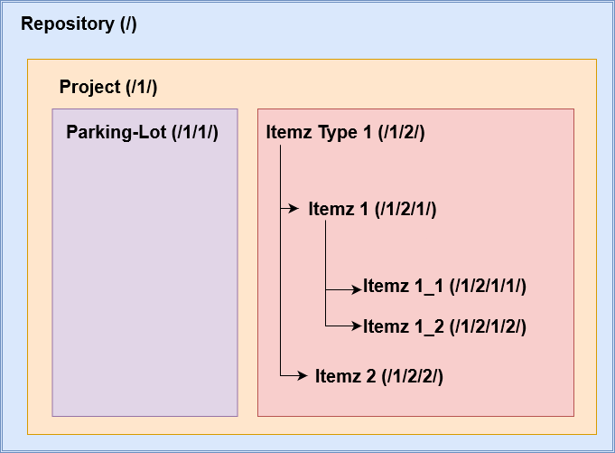
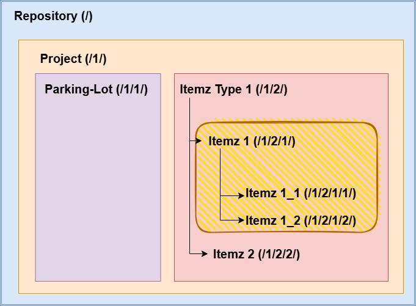
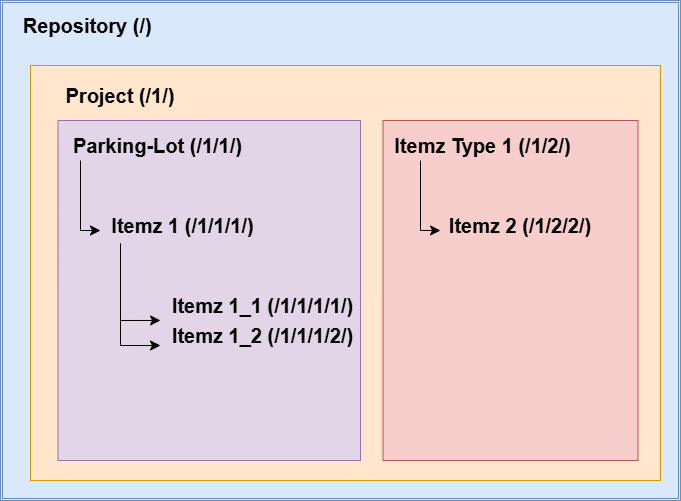


# Default implementation for Hierarchy ID format

The ItemzApp will automatically generate Hierarchy ID for following type of data that put to gether creates Data Container and Parent and Child requirements breakdown structure. ItemzApp will generate Hierarchy ID for ...

    - Repository
    - Project
    - ItemzType
    - Itemz

Separate to above Hierarchy IDs, ItemzApp is designed to take Baselines and it maintains Baseline Hierarchy ID in a separate table within the repository. It contains following type of data for which Baseline Hierarchy ID will be generated

    - Repository
    - Project
    - Baseline
    - Baseline ItemzType
    - Baseline Itemz

Here is an example diagram in which we show repository containing 1 project with default Parking Lot Itemz type. Then we have "Itemz Type 1" that contains 2 Itemz in it. Then 1st Itemz contains further 2 child Itemz. Next to each containers and Itemz within breakdown structure, we can see Hierarchy ID as string represenation within curly brackets. 

As you can observe in above diagram, each new container level introduces next additional "\{number\}/" at the end of the Hierarchy Id string representation.

# Design Decision for Itemz Hierarchy Data when Parent Itemz is deleted.

The ItemzApp supports requirements breakdown structure by allowing multiple levels of hierarchical data to be captured and maintained in the system. ItemzApp will support nested Itemz breakdown structure -  this means that, Itemz either be the child of ItemzType or Itemz while it is associated with in a project. Orphaned Itemz are not assigned a Itemz Hierarchy ID as it’s not included in the project structure. Hence, they treated as Individual/Independant Itemz. 

So, in the following example, we have created a Project. Within the project, we have the default ItemzType Parking lot and, at the same level, we have created an additional ItemzType1 container. Within both these containers, we have their unique Itemz breakdown structure. 

The following Table shows the ItemzHierarchyIds that are allocated to different nodes within the ItemzHierarchy breakdown structure. 

| ItemzHierarchy Node Name | ItemzHierarchyId as String |
| ------------------------ | -------------------------- |
| Repository               | /                          |
| Project 1                | /1/                        |
| Itemz Type Parking Lot   | /1/1/                      |
| Itemz Type 1             | /1/2/                      |
| Itemz 1                  | /1/2/1/                    |
| Itemz 1_1                | /1/2/1/1/                  |
| Itemz 1_2                | /1/2/1/2/                  |
| Itemz 2                  | /1/2/2/                    |
| Itemz 2_1                | /1/2/2/1/                  |

Now, consider that we remove Itemz 1 from the repository. 
The system is designed so that when a parent, in this case ‘Itemz1’, is removed, all of that container’s children are removed as well, i.e ‘Itemz 1_1’ and ‘Itemz 1_2’. A grand total of 3 records will be removed. So, when the user permenantly deletes a parent container, the breakdown structure of children, grandchildren etc associated with it will also be permenantly removed.
Because “Itemz 1” is parent of “Itemz 1_1” and “Itemz 1_2”, we will have to remove all those 3 records from the repository. System is designed to remove Itemz including it’s child Itemz records when it comes to deleting parent “Itemz 1”

This means we will be left with following Itemz with their associated Hierarchy IDs as per below table.

| ItemzHierarchy Node Name | ItemzHierarchyId as String |
| ------------------------ | -------------------------- |
| Repository               | /                          |
| Project 1                | /1/                        |
| Itemz Type Parking Lot   | /1/1/                      |
| Itemz Type 1             | /1/2/                      |
| Itemz 2                  | /1/2/2/                    |
| Itemz 2_1                | /1/2/2/1/                  |

So, we will end-up with a gap between “/1/2/” and “/1/2/2/” as we will be not having a container “/1/2/1/” anymore in the system. This should work just fine when we try to query Itemz Hierarchy Data from the repository. This will not present any issues while querying Itemz Hierarchy data from the repository.

Let’s have a look at cons and pros for both these options.

In the First option where we keep baseline creation logic within Web API Application.

---

# Design Decision  for Moving Itemz (including the Child Itemz structure)

ItemzApp shall support moving Itemz from one place to another within the project or across different projects. When we move parent Itemz, we also move the associated child Itemz breakdown structure to the new location. The system also automatically reassignes new HierarchyIDs to each of the moved Itemz so that the new IDs appropriately reflect the new environment the Itemz are in.

Calculation of the new Itemz HierarchyId is based on the target location where we are moving the Itemz. In total, there are three main  categories of Itemz Move. They are…

- Move Between two existing Itemz at the same hierarchy level
- Move as a child to the TOP position of target ItemzType or Itemz
- Move as a child to the BOTTOM position of target ItemzType or Itemz 

#### Moving Scenario 1
As per the following diagram, we are moving Itemz 1 over to the Parking Lot area. Currently, Parking Lot does not have any Child Itemz and so Itemz1 will obtain ID “/1/1/1/” and sub Itemz will also be updated accordingly. 

After moving "Itemz 1" to the Parking Lot, we will end-up with following Hierarchy strcuture.

#### Moving Scenario 2

Lets consider that we have following Hierarchy structure in our repository

| Hierarchy Node Name | HierarchyId as String |
| ------------------- | --------------------- |
| Repository          | /                     |
| Project1            | /1/                   |
| ParkingLot          | /1/1/                 |
| ItemzType1          | /1/2/                 |
| Itemz1              | /1/2/1/               |
| Itemz1.1            | /1/2/1/1/             |
| Itemz2              | /1/2/2/               |
| ItemzType2          | /1/3/                 |
| Itemz3              | /1/3/1/               |
| Itemz3.1            | /1/3/1/1/             |

In this example, we are moving "Itemz 3" which is currently a child element under "ItemzType 2". Lets move "Itemz 3" in between "Itemz 1" and "Itemz 2". Because "Itemz 1" has hierarchy id "/1/2/1/" and "Itemz 2" has hierarchy id "1/2/2/", system shall allocate hierarchy id as "1/2/1.1/" to "Itemz 3". Also it will allocate correct hierarchy ID to "Itemz 3.1" as "/1/2/1.1/1/" to make it immediate child of "Itemz 3". 

After the move, Hierarchy breakdown structure will look as per below table.

| Hierarchy Node Name | HierarchyId as String |
| ------------------- | --------------------- |
| Repository          | /                     |
| Project1            | /1/                   |
| ParkingLot          | /1/1/                 |
| ItemzType1          | /1/2/                 |
| Itemz1              | /1/2/1/               |
| Itemz1.1            | /1/2/1/1/             |
| **Itemz3**          | **/1/2/1.1/**         |
| **Itemz3.1**        | **/1/2/1.1/1/**       |
| Itemz2              | /1/2/2/               |
| ItemzType2          | /1/3/                 |

ItemzApp uses underlying Database capabilities to automatically generate Itemz hierarchy id when we move Itemz between two existing Itemz. 

#### Moving Scenario 3

Lets consider that we have following Hierarchy structure in our repository

| Hierarchy Node Name | HierarchyId as String |
| ------------------- | --------------------- |
| Repository          | /                     |
| Project1            | /1/                   |
| ParkingLot          | /1/1/                 |
| ItemzType1          | /1/2/                 |
| Itemz1              | /1/2/1/               |
| Itemz1.1            | /1/2/1/1/             |
| Itemz2              | /1/2/2/               |
| ItemzType2          | /1/3/                 |
| Itemz3              | /1/3/1/               |
| Itemz3.1            | /1/3/1/1/             |

In this example, we are moving “Itemz 3” at the TOP of the Immediate breakdown structure of ‘Itemz1’. Now because “Itemz 1”. has hierarchy ID “/1/1/1/” and its current 1st child record has hierarchy ID of ‘/1/1/1/1/”, the system will allocate “1/1/1/0/” as hierarchy ID for “Itemz 3”. In this scenario, we took the current hierarchy ID of the first child and reduced it by 1. If we move any other records at  the TOP position under “Itemz 1” then it will receive the hierarchy ID “/1/1/1/-1/” and so forth.

| Hierarchy Node Name | HierarchyId as String |
| ------------------- | --------------------- |
| Repository          | /                     |
| Project1            | /1/                   |
| ParkingLot          | /1/1/                 |
| ItemzType1          | /1/2/                 |
| Itemz1              | /1/2/1/               |
| **Itemz3**          | **/1/2/0/**           |
| **Itemz3.1**        | **/1/2/0/1/**         |
| Itemz1.1            | /1/2/1/1/             |
| Itemz2              | /1/2/2/               |
| ItemzType2          | /1/3/                 |

#### Moving Scenario 3

Lets consider that we have following Hierarchy structure in our repository

| Hierarchy Node Name | HierarchyId as String |
| ------------------- | --------------------- |
| Repository          | /                     |
| Project1            | /1/                   |
| ParkingLot          | /1/1/                 |
| ItemzType1          | /1/2/                 |
| Itemz1              | /1/2/1/               |
| Itemz1.1            | /1/2/1/1/             |
| Itemz2              | /1/2/2/               |
| ItemzType2          | /1/3/                 |
| Itemz3              | /1/3/1/               |
| Itemz3.1            | /1/3/1/1/             |

In this example, we are moving “Itemz 3” at the BOTTOM of the child Itemz list of “Itemz 1”. Immediate breakdown structure of ‘Itemz1’.  Now because “Itemz 1” has hierarchy id “/1/2/1/” and its current last child records has an hierarchy ID of ‘/1/2/1/1/”, we shall be allocating “1/2/1/2/” as the hierarchy ID for “Itemz 3”. In this scenario we took the current hierarchy id of the last child and increased it by 1. If we move any other records at BOTTOM position under “Itemz 1” then it shall receive hierarchy id of “/1/2/1/3/” and so forth.

| Hierarchy Node Name | HierarchyId as String |
| ------------------- | --------------------- |
| Repository          | /                     |
| Project1            | /1/                   |
| ParkingLot          | /1/1/                 |
| ItemzType1          | /1/2/                 |
| Itemz1              | /1/2/1/               |
| Itemz1.1            | /1/2/1/1/             |
| **Itemz3**          | **/1/2/1/2/**         |
| **Itemz3.1**        | **/1/2/1/2/1/**       |
| Itemz2              | /1/2/2/               |
| ItemzType2          | /1/3/                 |

---

# Design Decision – Moving Itemz to different projects.

Sometimes, users may need to move Itemz from one project to another project along with its associated child breakdown structure. This could occur when users would like to restructure their projects or in cases where the user begins defining their requirements in a side project and once that reaches maturity, they decide to relocate that data into the main project. Users could use this feature to satisfying different needs for their product and services that they offer.

Lets consider that we have following Hierarchy structure in our repository

| Hierarchy Node Name | HierarchyId as String |
| ------------------- | --------------------- |
| Repository          | /                     |
| Project1            | /1/                   |
| ParkingLot          | /1/1/                 |
| ItemzType1          | /1/2/                 |
| P1_Itemz1           | /1/2/1/               |
| P1_Itemz1.1         | /1/2/1/1/             |
| P1_Itemz2           | /1/2/2/               |
| ItemzType2          | /1/3/                 |
| P1_Itemz3           | /1/3/1/               |
| P1_Itemz3.1         | /1/3/1/1/             |
| Project2            | /2/                   |
| ParkingLot          | /2/1/                 |
| ItemzType1          | /2/2/                 |
| P2_Itemz1           | /2/2/1/               |
| P2_Itemz1.1         | /2/2/1/1/             |
| P2_Itemz2           | /2/2/2/               |
| P2_ItemzType2       | /2/3/                 |
| P2_Itemz3           | /2/3/1/               |
| P2_Itemz4           | /2/3/2/               |

In this example, we are moving “P2_Itemz 1” from “Project 1, Itemz Type 1” over to “Project 2, Itemz Type 1” at the BOTTOM of existing child Itemz structure. Due to this move, the hierarchy ID for “P2_Itemz 1” will change from “/1/2/1/” to “/2/2/3/” because target “Project 1 Itemz Type 1” already has two child Itemz in it. Also “ P2_Itemz 1.1” from Project 2 will be moved over to Project 1 along with it’s parent “ P2_Itemz 1”. Due to this move, "P2_Itemz 1.1" Hierarchy Id will change from “2/2/1/1/” over to “/1/2/3/1/”

| Hierarchy Node Name | HierarchyId as String |
| ------------------- | --------------------- |
| Repository          | /                     |
| Project1            | /1/                   |
| ParkingLot          | /1/1/                 |
| ItemzType1          | /1/2/                 |
| P1_Itemz1           | /1/2/1/               |
| P1_Itemz1.1         | /1/2/1/1/             |
| P1_Itemz2           | /1/2/2/               |
| **P2_Itemz1**       | **/1/2/3/**           |
| **P2_Itemz1.1**     | **/1/2/3/1/**         |
| ItemzType2          | /1/3/                 |
| P1_Itemz3           | /1/3/1/               |
| P1_Itemz3.1         | /1/3/1/1/             |
| Project2            | /2/                   |
| ParkingLot          | /2/1/                 |
| ItemzType1          | /2/2/                 |
| P2_Itemz2           | /2/2/2/               |
| P2_ItemzType2       | /2/3/                 |
| P2_Itemz3           | /2/3/1/               |
| P2_Itemz4           | /2/3/2/               |

# Design Decision – Moving of ItemzType within project

By default, ItemzApp allows Itemz Type to be moved within a project. However, they still remain to be direct child elements of the project. i.e. you can move their position within the project by moving them either at the TOP, BOTTOM or in BETWEEN two ItemzType. The Hierarchy ID value for ItemzType will change according to it’s new position. 

Lets consider that we have following Hierarchy structure in our repository

| Hierarchy Node Name | HierarchyId as String |
| ------------------- | --------------------- |
| Repository          | /                     |
| Project1            | /1/                   |
| ParkingLot          | /1/1/                 |
| ItemzType1          | /1/2/                 |
| ItemzType2          | /1/3/                 |

In this example, we shall be moving Parking Lot ItemzType to the BOTTOM of the Projects’s child elements. This action will change Parking Lot ItemzType’s hierarchy ID from ‘/1/1/’ to ‘/1/4/’. This means that the new structure of the project will be as per the below table. 

| Hierarchy Node Name | HierarchyId as String |
| ------------------- | --------------------- |
| Repository          | /                     |
| Project             | /1/                   |
| ItemzType1          | /1/2/                 |
| ItemzType2          | /1/3/                 |
| **ParkingLot**      | **/1/4/**             |

Now if I move ParkingLot ItemzType between ItemzType1 and ItemzType2 then it’s HierarchyID string will become “/1/2.1/” 

# Design Decision – Moving of ItemzType to another project

ItemzApp will allow moving ItemzType to another project within the same repository. That said, beware that the Parking Lot ItemzType is not allowed to be moved because every project will contain one system defined Parking Lot ItemzType. But any child Itemz including its Itemz breakdown structure from within the Parking Lot ItemzType can be moved to another project at the users desired destination. 

Lets consider that we have following Hierarchy structure in our repository

| Hierarchy Node Name | HierarchyId as String |
| ------------------- | --------------------- |
| Repository          | /                     |
| Project 1           | /1/                   |
| Parking Lot         | /1/1/                 |
| ItemzType1          | /1/2/                 |
| ItemzType2          | /1/3/                 |
| Project 2           | /2/                   |
| Parking Lot         | /2/1/                 |
| ItemzType1          | /2/2/                 |

In this example, we moved ItemzType2 from Project1 to Project2. This action changed  the HierarchyId of the ItemzType2 from “/1/3/” to “/2/3”.  

| Hierarchy Node Name | HierarchyId as String |
| ------------------- | --------------------- |
| Repository          | /                     |
| Project 1           | /1/                   |
| Parking Lot         | /1/1/                 |
| ItemzType1          | /1/2/                 |
| Project 2           | /2/                   |
| Parking Lot         | /2/1/                 |
| ItemzType1          | /2/2/                 |
| **ItemzType2**      | **/2/3/**             |

ItemzApp does not support hosting two different ItemzType with the same name under a single project. That means moving ItemzType with the same name from one project to another project may fail. 
