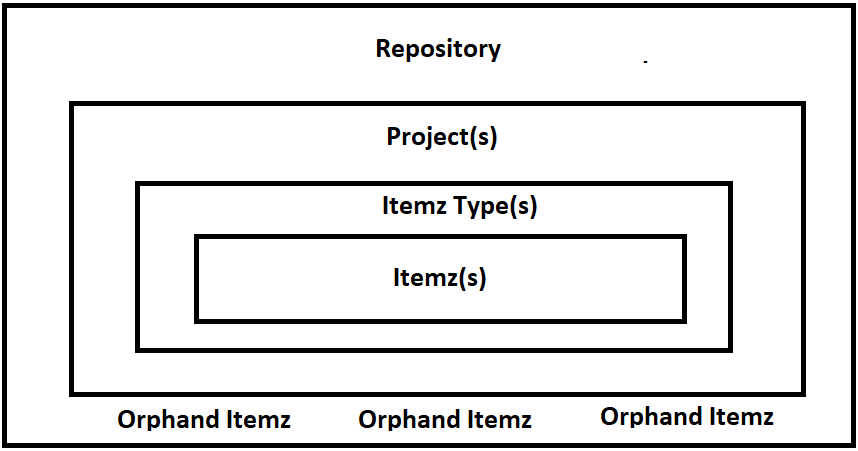

# Design Decision of Itemz Association

ItemzAPI supports hosting Itemz in two main ways. Placing Itemz in a project and having an Orphand Itemz which is not associated with a project.

ItemzAPI repository shall host zero or more projects. In each Project there will be one to many ItemzType. Each ItemzType will contain many Itemz. Plus Itemz which are not associated with ItemzType within a Project are considered to be Orphand Itemz.

So the data structure will look something like below.

Single Repository --> Project(s) --> Type(s) --> Itemz(s) 

[PLUS Orphand Itemz(s)]

Now, the concept that we are going to support in ItemzAPI would be to allow Itemz to be associated with only one ItemzType at any given point in time. This means we are not going to support making a single Itemz to be associated with multiple ItemzType within the same OR different project in a single repository. 

This is becauase, each Itemz will have traces, attachments, baseline, attributes, etc. that will have specific meaning and context that we have to preserve. 

If some users would like to re-user Itemz in different ItemzType within the same OR different project then we will support ability to Copy Itemz from one place to another place and create a new Itemz there. So it will be two different instances of Itemz which will then evolve independently. 

One another concept we will support is to move Itemz from one ItemzType to another ItemzType within the repository. We shall also think about which all properties of an Itemz shall we move over. i.e. shall we move Itemz with all custom properties, traces, attachments, etc. Well, this is something we will take decision about in the future. 

One of the feature that we would like to support but with better design in the future would be to have Master and Child (i.e. copies) Itemz. So a master copy will be managed and published into child copies via centralized team who is managing the master copy. This will allow definition and management control over in the central team while implementation and deliveries in the hands of teams who are adhering to such master Itemz. We have already implemented Many-to-Many relationship between Itemz and ItemzType in the repository but we are trying to softly deny one Itemz to be associated with multiple ItemzType by placing restrictions and deny logic in repository services that associates Itemz with ItemzType.

At this stage, it's possible to disassociate Itemz from a given ItemzType and so it becomes Orphand Itemz. Later one can re-associate an Orphand Itemz with ItemzType within a given repository. This could be one possible path to move Itemz between different ItemzType. 

# Conclusion

At any given point in time, An Itemz will be associated with one ItemzType OR be Orphand. This way, we only allow them to be present at one location at any given time. 

