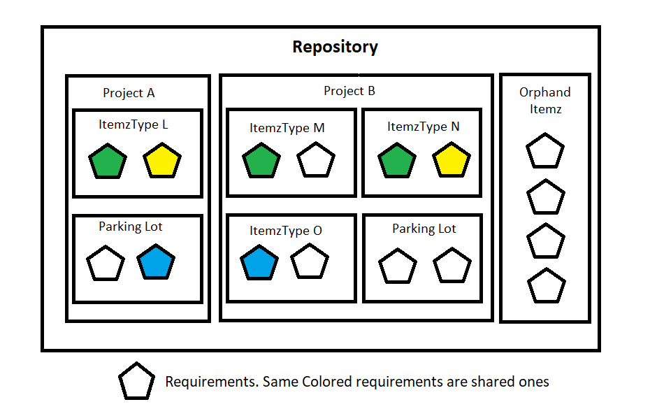


# Concept of Project in Itemz App

One of the most important characteristic of a Itemz would be unambiguous and easy to understand.  To achieve this, Itemz will be captured and possibly refined by the same person or by group of people (mainly business analysts).

When many people are involved in fine-tuning given Itemz then it might be very much possible that it would be done in a completely disconnected mode. Which means that person who is writing / capturing the initial version of the itemz may define it upto the point where next person in the chain will be able to further enhance the same.

At the initial time of writing conceptual itemz, it might not be possible for that person to know about exact project in which this Itemz will end-up. If they know the target project then they could simply create this itemz in the target project but otherwise that person will have to park the itemz in a generalized area which can then be "put into a single project" or shared amongst multiple projects.

Good thing is that we are going to treat this Itemz as a node and so it becomes easy to be re-used in multiple projects. While this is our target approach for handling Itemz re-usability needs, we have to design the implementation in a careful way.

Let's start capturing few needs based on above considerations.

#### Single Itemz being shared in multiple projects.

It's easy to think that it should be possible to have a single Itemz being shared amongst multiple projects and it should come naturally to be implemented via Many to Many relationship between Itemz and projects. Well, now that we have implemented ItemzType that sits in between Projct and Itemz, then technically speaking Itemz and project do not share Many to Many relationship directly. Please refer to `Concept Of ItemzType` for more details.

What about maintaining the Itemz centrally and having shallow copy being shared amonst the target projects? In this case, centrally might be that it was maintained in the same Itemz App repository as the one where Projects are found or it could be another Itemz Repository from which itemz will be exported and imported in target repository where project is found.

The core part of the Itemz repository shall be designed such that it should support "Centrally" updated items to be deployed into projects that are sharing them.

Within Centrally maintained repository, it might be part of a project or it might be just contained in the repository without any project association. Such items could be identified via filtering criteria and then can be shared into target repository.

Consider a large organization in which they define security requirements for the project that they are developing. Security team is well formed with skilled people who defines various different levels of security requirements in the repository which is owned by them.

Say we call this Security Teams Requirements repository as "CompanyXYZ Security Repo" and it contains 100 requirements that are classified into following groups

Basic Security Requirements = 20

Medium Security Requirements = Basic Security Requirements + 30 = Total of 50

High Security Requirements = Medium Security Requirements + 30 = Total of 80

FullSet Security Requirements = High Security Requirements + 20 = Total of 100

Now when a new project starts and the stakeholders / security team comes along and says that this new project shall meet our Medium Security Requirements then it should be possible to shallow copy those 50 requirements over to newly initiated project which may live in a completely separate Itemz repository. Lets call this repository as "CompanyXYZ ProgrammeA Repo"

Subsequently it should be possible to compare and publish any updates that we identify in the High Security Requirements from "CompanyXYZ Security Repo" over to "CompanyXYZ ProgrammeA Repo" and update those requirements there too. Because they are two separate Itemz repositories, it will not be possible to have a direct link between them and so it has to be handled by synchronization software.

In this case, for the bundled 50 Itemz classified as "Medium Security Requirements" which resides in repository "CompanyXYZ Security Repo" is considered as Master while the same set of itemz that are published into "CompanyXYZ ProgrammeA Repo" are considered as shadow / copies of the itemz.

It's possible that within target repository "CompanyXYZ ProgrammeA Repo", there might be several projects defined and many of them might be sharing "High Security Requirements" that came in from "CompanyXYZ Security Repo".

#### Creating a sharable bundle from existing project requirements

In some cases, a given project might have well defined itemz that should be converted into a sharable set of Itemz that other projects can copy from. This means that from this existing project, one has to identify required itemz based on some sort of filter and then create that bundle to be sharable.

While we create a sharable bundle from a base project, we could chose this sharable bundle to remain as part of that project or create a new project only to contain sharable bundled itemz or we export it and import it in completely different repository.

What we observe is that to satisfy this need, we have to consider logical many-to-many relationship for Projects and Itemz. Please also take into account that technically Itemz are associated with Project via ItemzType.

#### Parking lot

It will be ideal to support the concept of Parking lot ItemzType in ItemzApp repository within every Project. This will be treated as System Type that shall be available in every project. Newly imported Itemz that does not belong to any existing ItemzType will be imported into Parking Lot. Also, when Itemz are soft deleted from existing ItemzType then they will move into Parking Lot before they are ready to be permanently deleted. 

During requirements capturing process, Business Analysts might come across good Ideas, improvement opportunities, knowledge articles, etc. that they would like to store somewhere to start with. Later, after finalizing such Itemz, they can be moved at appropriate place. Again, for supporting this scenario, Parking Lot ItemzType will be very convenient for users.

Also, when we import Itemz into a given project without specifying target ItemzType then it will be ideal to put them in the Parking Lot ItemzType and host them there.

#### Delete Itemz from a given project.

Ideally, we should implement concept of Recycle Bin. This means Itemz which are deleted via "Project Deletion" command will only be soft deleted and shall be moved to recycle bin. Such Itemz are called Orphand Itemz and are not associated with any Project or ItemzType.
Itemz that are imported into repository but are not associated with Project and ItemzType shall by default appear in the Orphand Itemz list at the repository level.

#### Template Project

There might be a need to allow creating new project from an existing project so that multiple itemz are populated automatically to start with.

This way, users can define certain standards to be implemented for new project initiative. In fact, a project might pull in Itemz from existing project or from Parking Lot area and form it's initial baseline.

#### Orphaned Itemz

In case where entire Project is deleted then all the Itemz that are part of that project shall be moved to Orphaned Itemz. This allows users to retrieve those Itemz as necessary in the future. On the other hand, if they need to be permanently removed from the repository then users can delete them one more time from Orphaned Itemz list. 

# Conclusion

 - Project and ItemzType will have One to Many Relationship.
   
 -  ItemzType and Itemz will have Many to Many relationship.
   
 -  One project may contain Zero to Many Itemz via ItemzType.
   
 -  One Itemz may belong to Zero to Many ItemzType across multiple
   Projects.

This flexibility is key for supporting future enhancements for Itemz App.

