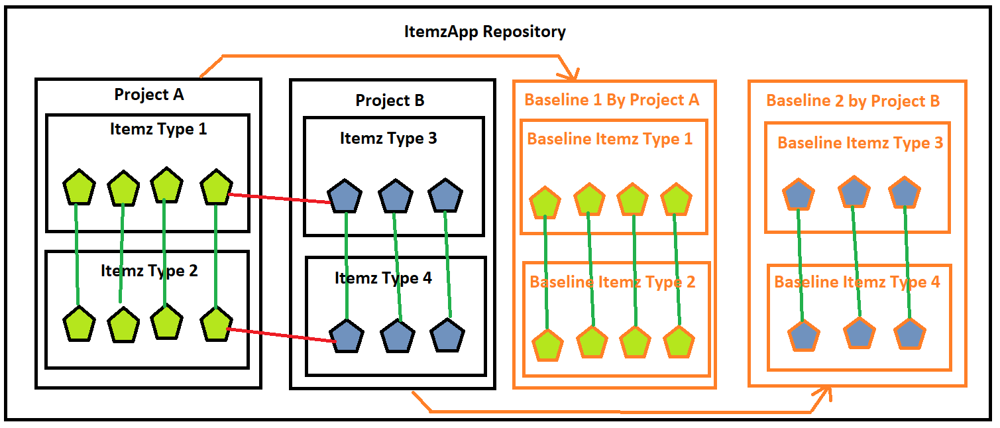
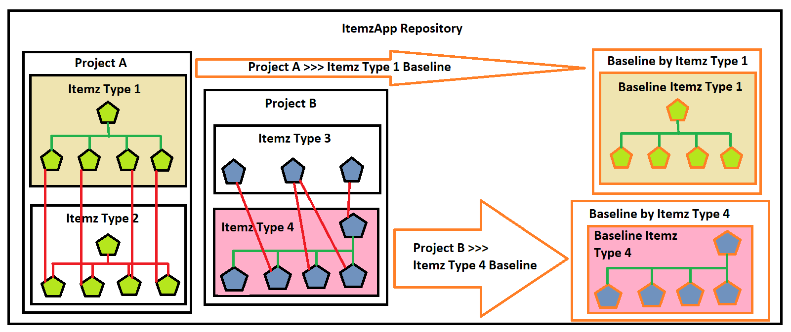


# DesignDecisions of Baselining and Traceability

In ItemzApp, we allow users to capture their requirements across different requirements types. They then link those requirements via traceability functionality. These traces can link requirements that are present in the same requirement type or across multiple requirement types. Plus, those requirements could be also present in different projects over different requirement types too. 

Now the purpose of baseline is to capture snapshot of the requirements at the time when baseline was captured. So, we define scope of the baseline. By default, system supports Project Baseline or ItemzType baseline snapshots. When project baseline is captured then Itemz which are in scope of the project across multiple ItemzType are all included in the baseline snapshot. So, we also carry along traceability data between those Itemz which are in scope of the project baseline.

### Project Scoped Baselines
Following diagram shows scope of the project scoped baseline snapshot and included traceability in it. 

Project A has two Itemz Types as 1 and 2 respectively. Both Itemz Types contains 4 Itemz in each one of them. Itemz are linked to each other on a One-to-One bases i.e. 1st Itemz of Type 1 is linked to 1st Itemz of Type 2 and so on.

We also have Project B with two Itemz Types as 3 and 4 respectively. Both Itemz types contains 3 Itemz in each one of them. Itemz are linked to each other on a One-to-One basis i.e. 1st Itemz of Type 1 is linked to 1st Itemz of Type 2 and so on. 

We also have trace link established between 

“Project A >>> Itemz Type 1 >>> Itemz 4” to “Project B >>> Itemz Type 3 >>> Itemz 1” 

And 

“Project A >>> Itemz Type 2 >>> Itemz 4” to “Project B >>> Itemz Type 4 >>> Itemz 1” 

Now when we take baseline snapshot of Project A then it will take a copy of Itemz Types and Itemz contained within the “Project A” and create same structure within Baseline 1. You will notice that it carries 4 traces as well which are within the scope of the Baseline 1. But those two traces which are identified as RED colored traces between Itemz from “Project A” to Itemz in “Project B” are not carried into the Baseline. 

### ItemzType Scoped Baselines

Second type of supported baselines are scoped to Itemz Type. That means any Itemz which is contained within the ItemzType will be in the scope of the baseline. Other Itemz which are in the project but not contained within the targeted ItemzType will not be included.

Following diagram shows example of ItemzType scoped baseline snapshot.

Project A has two Itemz Types as 1 and 2 respectively. Itemz Type 1 has in total 5 Itemz with 4 traces between them depicted as green colored lines. Itemz Type 2 has 5 Itemz with 4 traces amongst them depicted as red colored lines. Also, there are trace links established between 4 Itemz from Itemz Type 1 over to 4 Itemz in Itemz Type 2 which are depicted as red colored lines. 

Now when we take snapshot based on Itemz Type 1 from within Project A then it should only carry over 5 Itemz which are part of Itemz Type 1 and 4 traces which are in scope of those 5 Itemz only. 

Itemz from Itemz Type 2 and all the traces depicted in red color within Project A are not carried over to Baseline Snapshot based on Itemz Type 1.

Similar is the case for Project B when Baseline Snapshot is created for Itemz Type 4. 

Baselines are fundamentally designed to be self-contained and they are snapshot from the past. 

### Pros :
-   It becomes possible to then generate reports from within the baseline without having impact due to external entities changing its properties. 
-	They become more like contracts and deliverables that is static by nature. So, they don’t really change apart from Inclusion and Exclusion of Individual Baseline Itemz.
-	They fundamentally become containers of static Itemz as a snapshot with all valid trace links pointing to Itemz within the scope of the baseline.

### Cons :
-	One has to take new Snapshots if there are any changes in the data within the scope of the Baseline Itemz
-	Less flexible even to modify trace relationships
-	Does not show information about traces that are established to external Itemz which is not in scope of the Baseline Itemz.
-	At the time of writing this article, design implementation was planned for only Project Scoped and Itemz Scoped Baselines. So, it’s not possible to create Baselines which are cutting across multiple projects. 

### Conclusion
Both, Project based and ItemzType based baselines are designed to take traces between Itemz which are in scope of the baseline. 

External traces to Itemz outsize of the baseline scope are not included in the baseline snapshot.

Baselines are designed to be self-contained.

---
## Supporting Excluding and Including Baseline Itemz and it's impact on Traces

As part of Baselines, we take a snapshot of Itemz either scoped by Project or by ItemzType. Along with Itemz, we also take snapshot of Itemz Traces based on the scope defined for baseline. At the time of creating Baseline, all the Itemz which are in scope of the Baseline are by default marked as Included in it. 

Post creating Baseline, we allow users to configure BaselineItemz to be included or excluded. This feature is introduced to support cases where scope of the delivery changes post Baseline snapshot was created. This could happen due to 

- Budget Constrains
- Complexity in developing and delivering defined Itemz
- Time constains
- Removing nice to have features
- Unclear definition of requirement
- Duplicate requirement
- etc. 

So when we mark a BaselineItemz as EXCLUDED then in effect we are proposing that this BaselineItemz is not in scope of the baseline any more. In such cases, all the From and To Traces for the excluded BaselineItemz should also be treated as ineffective and excluded. 

For example if BaselineItemz 1 is linked as Parent to 2, 3, 4 & 5. Also consider that Baseline Itemz 2 is linked as Parent to 6, 7 & 8. Now if we mark Baseline Itemz 2 as excluded then it's Parent trace to BaselineItemz 1 and child traces to Baseline Itemz 6, 7 & 8 should also be marked as ineffective / excluded. 

Below diagram shows us this example of excluding BaselineItemz 2 and it's impact on its Traces to Parent and Child Baseline Traces. Those traces which are linked with RED colourd line shall be excluded as well. 

In future if BaselineItemz 2 is marked back as Included then it's parent link to Baseline Itemz 1 and child trcaes to Baseline Itemz 6, 7 & 8 will also be automatically included.

