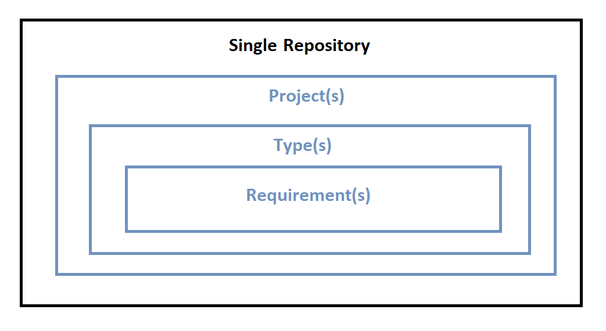

# Concept of Type in Itemz App

Grouping of requirements by it's type is very important. Different projects shall identify different types of requirments.

Below are few of the example requirement types

* Stakeholder Requirements - Mainly describes what sponsoros expects.
* Business Requirements - Capturing Need of the business
* Users Requirements - Users expectations from a given product / services
* Constrains Requirements - Boundaries and compliance related expectations
* Material Requirements - Different types of components / material that would be needed to produce a product
* Logistics Requirements - Transportantion and Frieght related expectations
* People Availability - People with different skills that would be required at different time during project / service execution
* Cost Management - Budget and estimations based on approved requirements.
etc. 

#### Purpose to classify by Requirement types

ItemzApp is developed by keeping it's general use in mind. Different types of projects would need different level of classification. For example, Road Construction project would have very different types of requiremnts then a project related to building healthcare equipment. Grouping requirements by types allows capturing expectations and needs from different group of people involved in the project. For example, users group who are going to use a healthcare equipment shall provide different details of their needs v/s sponsorors of the project v/s business needs and market expectations. 

Once different types of requirements are captured then negotiation and baselining activities can be performed based on allocated budget, availability of skills, speed to market, staying ahead of competitors, etc. 

#### Where does `type` fit in the structure?

Types are containers of requirements that are sitting under project. That means we expect following structure to be implemented in Itemz App as below.

Single Repository --> Project(s) --> Type(s) --> Requirement(s)

#### What about requirements that do not belong to any types?

If requirement is associated with the project but does not belong to any type then, by default, they shall be part of "Parking Lot" type. This can be considered as special type that is always available in every project.

#### Is Recycle Bin a type?

Idea of `Recycle Bin` is to have a container of deleted requirements. With Recycle Bin in place, it will ensure that deleted items are first moved into Recycle Bin and then to delete them permanently, one has to perform such deletion operation second time from within Recycle Bin. 

So `Recycle Bin` just becomes collector of deleted items but they don't allow items to be modified in there. This is why it's not equivalent to Requirement Types.

Also, `Recycle Bin` shall contain deleted items from different projects where as Requirment type by definition are part of a single project. 

#### Can one requirement be part of Multiple Types

Actually speaking, one requirement can be part of multipe projects and that means it could be part of multipe types. In most cases a single requirement will be associated with multiple types across multiple projects. In rare cases, it might be required to have a single requirement appearing in two different types within the same project. Though, Itemz App shall support this scenario as well.

# Conclusion

Single Project can have One or more Type(s).

Single Project is expected to have Parking Lot as in-build system type.

Types and Itemz will have Many to Many relationship.

One Itemz may belong to Zero to Many Projects.

This flexibility is key for supporting future enhancements for Itemz App.

 
