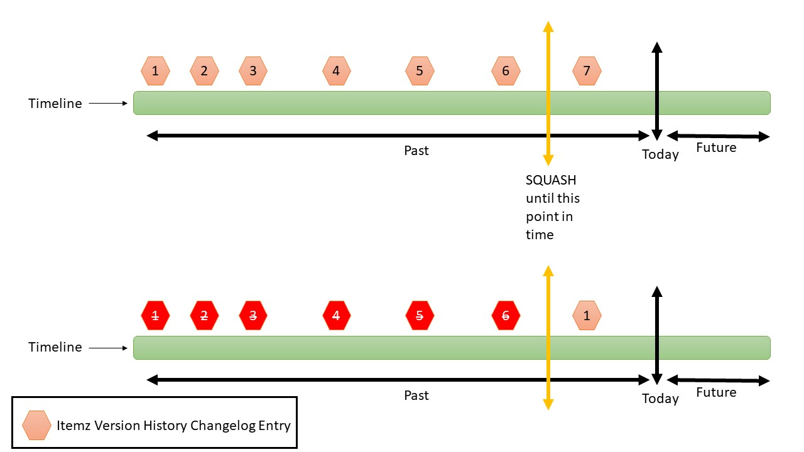

# Concept of Versioning Itemz

Every time Itemz data is saved in the database then a version history data has to be updated. Itemz records actions like add, update and delete has to be recorded for serving various purposes. It could be requirement from audit standpoint or otherwise it might be needed for the purpose of generating trend charts and reports.

### Definition of System and User Properties

Itemz record has several properties. Broadly speaking these properties can be classified into either system properties or custom user properties. Example of system properties are Name, status, priority, description, etc. Whereas example of custom user properties could be Target Date, Customer Priority, Estimation in Days, etc. Custom user properties are those that are introduced by the users / administrator at either Itemz type, Project or Repository level. At the time of writing this concept, ItemzApp had not yet implemented core in-build support for custom user properties. It&#39;s anticipated that in the future, it will be important for ItemzApp to allow custom user properties to be introduced by users / administrators against either Itemz Type OR project OR at repository level.

### Definition of Property Types

Each property (irrespective of whether it&#39;s System or User property) in ItemzApp shall be of a given type. ItemzApp shall support several types of properties to be created within the system. Example of property types are defined in below table.

| Property Type | Description |
| --- | --- |
| String | A field that can hold upto 128 characters of data. |
| Int | A field that holds integer value |
| Float | A field that holds floating values |
| Multiline Text | A field that hold large amount of formatted text data (e.g. HTML or Markdown) |
| Single Select Dropdown list box | A field that has predefined list of values to choose from |
| Multiselect Dropdown list box | A field that allows users to choose multiple items from a list box |
| Checkbox | A Boolean field |
| etc. etc. |

### What should be tracked?

Itemz version record shall track following key details when itemz is either added, modified or deleted.

- Log ItemzID that is related to Itemz Record in the database
- Log Date and Time information for each action that was performed against Itemz
- Store details about each property (irrespective of system / user properties) that was impacted
- Store details about old value and new value for each property that has been changed. As far as fields like single select dropdown, multiselect dropdown, checkbox, etc. are concerned, one has to store display name of the value that has changed.
- Who performed the change. Please take into account the fact that user might change it&#39;s email address and also leave the project in the future and so that user&#39;s details that is stored in Itemz Version History table shall be kept intact.
- When Itemz move from one place to another then it shall show such details about parent itemz in the itemz history.
- Fields like Sorting order **should not** be tracked as part of change history because it might change very frequently.
- Old value and new value should be stored as part of version history table. Decide if Description field changes should also be tracked or not because they are very large values.
- Each time version history table is updated for a given Itemz then we should increment revision number for that Itemz. In current design we are going to increase revision number by one each time.

### Deleting Itemz History data

ItemzApp shall allow removing history of Itemz. Main usage of ItemzApp is to produce requirements that are suppose to be used as a basis for the future work / delivery. Many contributors shall provide input for maintaining Itemz within ItemzApp. Over period of time, such historical change log might not be that important and removing it would benefit overall performance of the application.

Defined requirements generally goes through many rounds of review and adjustments. This changes are mainly cosmetic changes to the description and/or few other properties associated with the Itemz. What is important is to allow users to keep refining Itemz definition so that it becomes clearer and complete so that execution can be executed to the best possible quality to satisfy end-users. That said, such small changes are obsolete over time and they don&#39;t carry much value. That is why we have to design ItemzApp in such a way that it would allows removing old and obsolete history change log.

Let&#39;s take an example here to explain the same.

Following table shows sample Itmez History change log

| Date Time | Field Name | Old Value | New Value |
| --- | --- | --- | --- |
| 03 Aug 2020 14:20 | Title | | Book Flight |
| 03 Aug 2020 14:20 | Status | | New |
| 03 Aug 2020 14:20 | Description | | Allow users to book flight using online platform |
| 03 Aug 2020 14:20 | Priority | | Medium |
| 03 Aug 2020 14:20 | Severity | | Medium |
| 04 Aug 2020 10:12 | Status | New | Approved |
| 04 Aug 2020 10:23 | Title | Book Flight | Book Flight via website |
| 06 Aug 2020 16:44 | Priority | Medium | High |
| 06 Aug 2020 16:44 | Severity | Medium | High |
| 07 Aug 2020 15:38 | Status | Approved | Committed |

Given that we have above change log and now user decided to remove logs all the way to 05 Aug 2020 at 10.30 then we have to remove following entries from the database.

| Date Time | Field Name | Old Value | New Value |
| --- | --- | --- | --- |
| 03 Aug 2020 14:20 | Title | | Book Flight |
| 03 Aug 2020 14:20 | Status | | New |
| 03 Aug 2020 14:20 | Description | | Allow users to book flight using online platform |
| 03 Aug 2020 14:20 | Priority | | Medium |
| 03 Aug 2020 14:20 | Severity | | Medium |
| 04 Aug 2020 10:12 | Status | New | Approved |
| 04 Aug 2020 10:23 | Title | Book Flight | Book Flight via website |

And we update values as of 05th August 2020 to show following values that were bought forward due to removal of historical data.

| Date Time | Field Name | Old Value | New Value |
| --- | --- | --- | --- |
| 05 Aug 2020 10.30 | Title | | Book Flight via website |
| 05 Aug 2020 10.30 | Status | | Approved |
| 05 Aug 2020 10.30 | Description | | Allow users to book flight using online platform |
| 05 Aug 2020 10.30 | Priority | | Medium |
| 05 Aug 2020 10.30 | Severity | | Medium |
| 06 Aug 2020 16:44 | Priority | Medium | High |
| 06 Aug 2020 16:44 | Severity | Medium | High |
| 07 Aug 2020 15:38 | Status | Approved | Committed |

In above operation, we removed all the entries upto 05th August 2020 at 10:30 and we started by capturing values from that point onwards.

### Removal of Itemz history at several levels

The way we think about this option is to allow removal of Itemz history at several levels as per below.

- **Repository**

When user selects removal History data at repository level then ItemzApp shall remove history upto a specified date and time point for all the itemz in the repository. It will travel through each active project and remove Itemz history across all requirements that are part of the given repository. This is going to be very powerful operation that will remove historical data across large set of data but then it will help improve performance of the system at large too.

- **Project**

We are now scoping removal of Itemz History at the project level. This way, user can execute removal of itemz history change log upto a certain date and time point for all the itemz that are part of the given Project.

- **Itemz Type**

We are now scoping removal of Itmez history changelog within Itemz Type level which is part of a given project.

- **Individual Itemz**

At this level, user can remove Itemz History for a single identified Itemz only. Many times, users make too many changes to individual itemz and so such option will come handy.

### Rolling back changes on Itemz to previous version

ItemzApp shall allow users to rollback to a given point in time which means data for the given Itemz shall move back to what it was at that time. This will actually add new entries in the History table to show that a rollback was performed.

### What about Links and Attachments?

At the time of writing this document, we have not yet implemented concept of Links and Attachments. That said, they are considered as special type properties that holds specific data that is nothing but externally referenced data. Itemz links are referencing other Itemz in the repository where as Attachments are referencing to files that are uploaded by the users in the application.

As far as removing history changelog is concerned, ItemzApp shall support adding audit entries in the History log as how we maintain changes information for other properties (i.e. System and User Properties). This will also work well when we have to remove certain History change log for links and attachments related metadata.

### What about properties that are now removed?

Lets consider that one custom property was associated with Itemz for a given period of time during which there were registered changes associated with it while user changed it’s value. ItemzApp must have captured historical change log for this property over this time. 

Now lets consider that user decides to remove this property from the Itemz. In such an event, ItemzApp shall get confirmation from the user that they are fine to remove this property and it’s associated version history changelog data that was captured during this time. If user confirms the same and decides to remove custom property from the Itemz then we shall remove associated version history changelog for the same as well. This shall be treated as cascade delete for removed properties from the Itemz as far as version history changelog is concerned.  

### What about Configuration to allow switching Versioning On / Off

This would not be required for ItemzApp. We should always capture Itemz history changelog. Users can decide to wipe out older version entries if needed at several levels as described above. This way ItemzApp shall allow users to later wipe out old version history changelog data if not required to be maintained in the future.

### User Permission to execute removal of versioning history data

At the time of writing this document, we didn’t had authentication and authorization in place. Due to which we have not yet decided on specific role and permission via which removal of Itemz history changelog data can be controlled for removal. In the future, when we cross that bridge to implement data security for ItemzApp then we shall include option for configuring authorization related to removal of Itemz History changelog data.

### Concept details

In the following picture, you can see the timeline bar which represents changes that are registered on a given Itemz over a period of time. Each change is representated by a hexagone icon with a revision number on it. 

You can clearly see past, present and future timeline details on the diagram. 

User is now willing to remove Itemz history upto the point which is marked as **SQUASH** on the diagram. 

Post performing deletion (that is **SQUASHING**) Itemz history upto a given point, one can see that old version history is removed as represented via red hexagone icons and the 1st revision now starts just after the **SQUASH** date and time point.

### Check Periodically

-	No Itemz history data shall be available in the repository Prior to the SQUASH time set for the Repository.
-	No Itemz history data shall be available in the repository Prior to the SQUASH time set for the Project in which it is present
-	No Itemz history data shall be available in the repository Prior to the SQUASH time set for the Itemz Type in which it is present
-	No Itemz history data is available for the properties that are not associated with the Itemz

